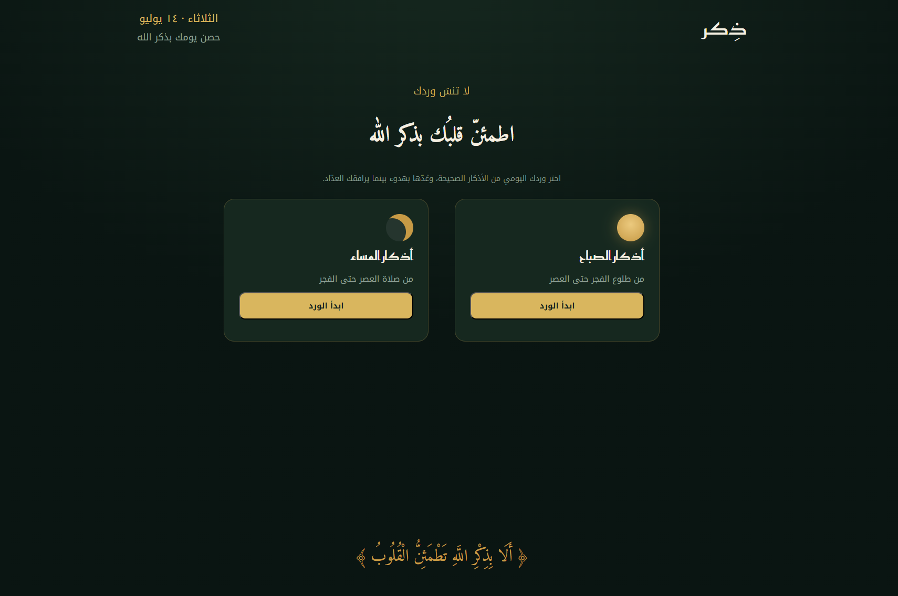
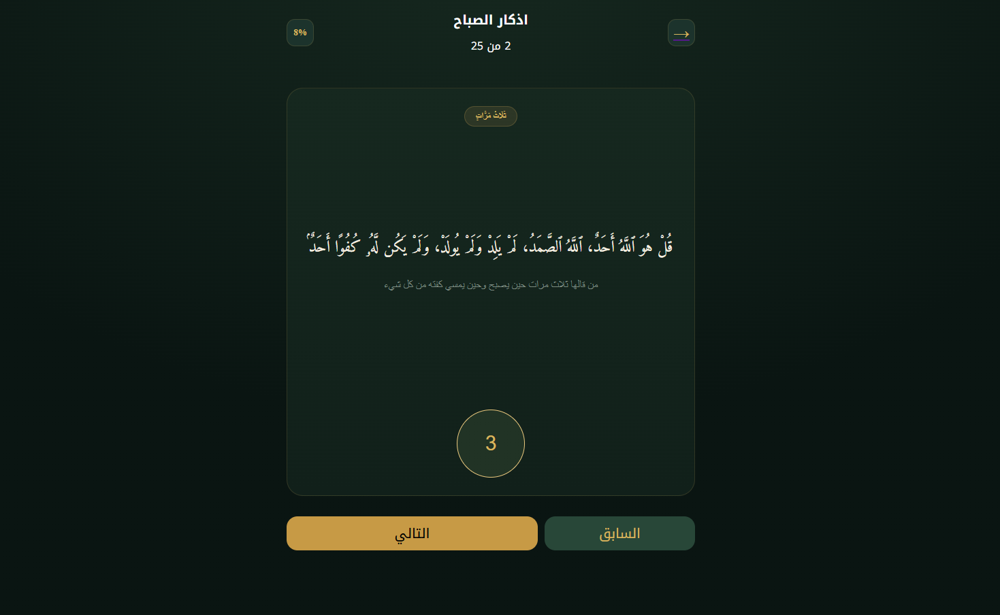

# تطبيق الأذكار - Thikr App

# 📿 Thikr App

A simple and modern web application for reading Morning and Evening Adhkar.

## ✨ Features

* Morning Adhkar
* Evening Adhkar
* Clean Desktop user interface
* Progress through each dhikr
* Display repetition count and virtue for every dhikr

## 🛠️ Built With

* React
* React Router
* CSS3
* JSON Data

## 🚀 Project Status

This project is currently in the MVP (Minimum Viable Product)** stage.

### Planned Features
* responsive design
* Audio playback
* Search
* Favorites
* Reading progress persistence
* Dark/Light theme
* Additional categories of adhkar

## 📄 Data Source

The adhkar content is based on (https://github.com/Seen-Arabic/Morning-And-Evening-Adhkar-DB/tree/main)

## 📸 Preview

Landin Page

Adkar Component

## 🌐 Live Demo

(https://thikr-app-indol.vercel.app/)
